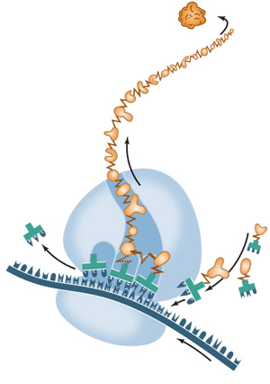

# Clojure Data DSL

## What is data and what is code?

*Data* - plural of datum (given)

Данные - нечто что можно взять
Информация в форме, которую можно потрогать

*Code*

* система знаков
* происходит от codex - пень, колода, дощечка для записи

## Interpreter!

The only difference is interpreter.

Data + Interpreter = Code

## Interpreters examples

CPU & instructions
DNA & ribosomes

## Homoiconicity

Десятое правило Гринспена

> Any sufficiently complicated C or Fortran program contains an ad hoc, informally-specified, bug-ridden, slow implementation of half of Lisp.

Greenspun's tenth

Like JS in JSON.

## Apps & Systems

Our apps essensialy just gives user
ability to program CPU.

## Declarativity

Scale of decalrativity

What or how?

## DSL

Chemistry, Math & Physic notations
Why?

Common Language is not enought exact

## LISP

Write DSLs and then write a programm!

## DSLs

* macro - Macros are opaque at runtime
* functions - first class value, but black box in runtime
* data - structure is available in runtime

Interpreters are much easier to write than compilers

> The best reason I can think of is that our data is usually a very restricted form of code, many times not Turing complete.
> Turing complete code is proven to be impossible to analyze.
> But our restricted data model is powerful in exactly the way we need it (for our specific problem), but not generally powerful (as in Turing complete).
> So we can design it to be analyzable.

Idea of data-driven programming

http://www.lispcast.com/data-functions-macros-why

## Data DSLs

html, css 

## hiccup

[:body]

## honeysql (datalog)

{:select [:*]
 :from [:table]}

## route-map

{:GET 'welcome
"posts" {:GET 'list
         [:id] {:GET 'show}}}

## schema

{:key (maby (enum :a :b :c))}

## validation framework ???

## License

Copyright © 2015 niquola

Distributed under the Eclipse Public License either version 1.0 or (at
your option) any later version.
